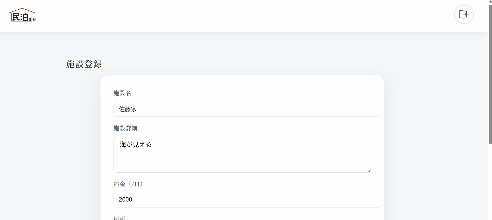
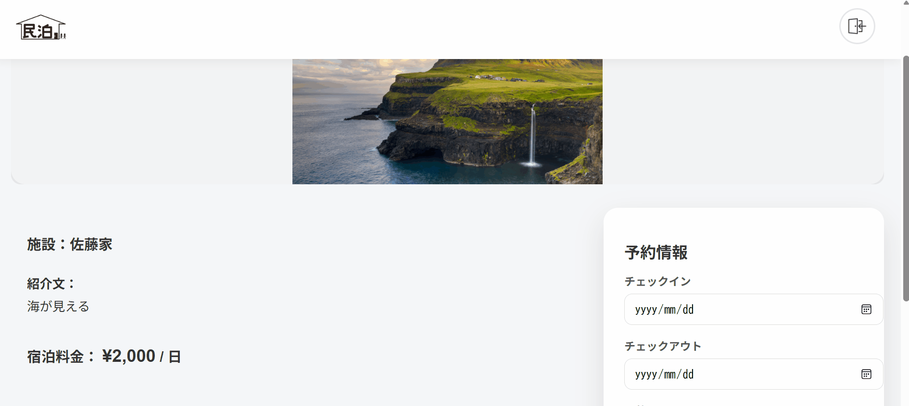

# Minpaku - 民泊予約アプリ


---

## ■ アプリ概要

Minpakuは、民泊施設を検索・予約できるWebアプリケーションです。
ユーザーはエリア検索を行い、施設詳細を確認し、予約までをアプリ内で完結できます。

Railsを用いたWebアプリケーション開発の実践として、

* ユーザー認証
* CRUD処理
* 検索機能
* モデル関連付け
* 予約処理

など、実務でよく利用される機能を実装しています。

---

## ■ 開発背景

近年、旅行需要の増加に伴い民泊サービスを利用する機会が増えています。

しかし、施設を探す際に

* 希望エリアの施設が見つけにくい
* 施設情報を確認してから予約するまでの手順が分かりづらい

といった課題があると感じました。

そこで、ユーザーが **シンプルな操作で施設検索から予約まで行えるサービス** を想定し、本アプリを開発しました。

### 対象ユーザー

民泊施設を利用したい旅行者

### 解決したい課題

* エリア検索のしづらさ
* 予約までの手順の煩雑さ

### 解決方法

* エリア検索による施設の絞り込み
* 施設詳細ページで情報と画像を確認
* 予約機能によりアプリ内で予約完結

---

## ■ アプリURL

https://minpaku.onrender.com

---

## ■ 使用技術

| 技術         | 内容     |
| ---------- | ------ |
| Ruby       | 3.x    |
| Rails      | 7      |
| PostgreSQL | データベース |
| Devise     | 認証     |
| Bootstrap  | UI     |
| Render     | デプロイ   |

---

## ■ 機能一覧

### ユーザー機能

* 新規登録
* ログイン / ログアウト
* ゲストログイン
* マイページ
* 予約履歴確認

### 施設機能

* 施設一覧表示
* エリア検索
* 施設詳細
* 施設登録
* 施設編集
* 画像アップロード

### 予約機能

* 予約作成
* 予約確認
* 予約キャンセル

### その他

* お気に入り機能

---

# ■ 機能デモ

### ログイン機能


---

### 施設検索

エリア名から施設を検索できます。


---

### 施設登録

施設情報と画像を登録できます。



---

### お気に入り機能

施設をお気に入り登録できます。


---

### 予約機能

施設予約をアプリ内で完結できます。



---

## ■ ER図


---


# ■ システム構成

### フロントエンド

* HTML
* CSS
* Bootstrap

### バックエンド

* Ruby on Rails

### データベース

* PostgreSQL

---

# ■ データベース設計

| テーブル         | 説明   |
| ------------ | ---- |
| users        | ユーザー |
| facilities   | 施設   |
| rooms        | 部屋   |
| reservations | 予約   |

### モデル関連

User
has_many :reservations

Facility
has_many :rooms

Room
belongs_to :facility
has_many :reservations

Reservation
belongs_to :user
belongs_to :room

---

# ■ 検索機能の実装

施設検索では **roomsテーブルとfacilitiesテーブルをJOIN** して検索しています。

```ruby
Room.joins(:facility)
```

エリア検索は部分一致で実装しています。

```ruby
where("facilities.address LIKE ?", "%#{params[:area]}%")
```

---

# ■ パフォーマンス対策

一覧表示では `includes` を使用して **N+1問題を回避**しています。

```ruby
Room.includes(:facility)
```

---

# ■ ディレクトリ構成

```
minpaku
 ├ app
 │ ├ controllers
 │ ├ models
 │ ├ views
 │
 ├ config
 ├ db
 ├ public
 ├ docs
 │ ├ login.gif
 │ ├ facility_search.gif
 │ ├ facility_register.gif
 │ ├ favorite.gif
 │ └ reservation.gif
 │
 └ README.md
```

---

# ■ 工夫した点

* JOINを利用した検索機能
* Deviseを用いた認証
* モデル関連付けを意識したDB設計
* シンプルなUI

---

# ■ 苦労した点

* 施設 / 部屋 / 予約の関連設計
* 予約確認画面のパラメータ受け渡し
* バリデーション設計

---

# ■ 今後の改善

* 管理者機能
* レビュー機能
* Stripe決済
* AWS環境移行
* 検索条件追加

---

# ■ ローカル起動

```
git clone https://github.com/yuyu214/minpaku.git
cd minpaku
bundle install
rails db:create
rails db:migrate
rails s
```

アクセス

```
http://localhost:3000
```
